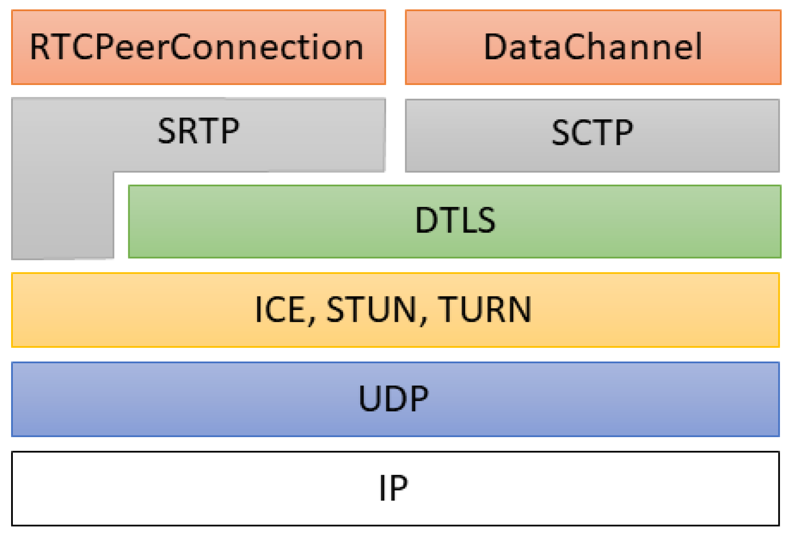

<h1 align="center">
 
  
</h1>

  
 
 
  
 
 
 
   

 A pure Rust implementation of WebRTC stack. Rewrite Pion WebRTC stack (<a href="http://Pion.ly">http://Pion.ly</a>) in Rust

<strong>Sponsored with 💖 by</strong> 

 

# Roadmap

### Work in Progress Towards 1.0

[sdp-badge]: https://img.shields.io/crates/v/sdp.svg
[sdp-url]: https://crates.io/crates/sdp
[rtp-badge]: https://img.shields.io/crates/v/rtp.svg
[rtp-url]: https://crates.io/crates/rtp
[rtcp-badge]: https://img.shields.io/crates/v/rtcp.svg
[rtcp-url]: https://crates.io/crates/rtcp
[srtp-badge]: https://img.shields.io/crates/v/webrtc-srtp.svg
[srtp-url]: https://crates.io/crates/webrtc-srtp
[dtls-badge]: https://img.shields.io/crates/v/webrtc-dtls.svg
[dtls-url]: https://crates.io/crates/webrtc-dtls
[stun-badge]: https://img.shields.io/crates/v/webrtc-stun.svg
[stun-url]: https://crates.io/crates/webrtc-stun
[mdns-badge]: https://img.shields.io/crates/v/webrtc-mdns.svg
[mdns-url]: https://crates.io/crates/webrtc-mdns
[ice-badge]: https://img.shields.io/crates/v/webrtc-ice.svg
[ice-url]: https://crates.io/crates/webrtc-ice
[turn-badge]: https://img.shields.io/crates/v/turn.svg
[turn-url]: https://crates.io/crates/turn
[sctp-badge]: https://img.shields.io/crates/v/webrtc-sctp.svg
[sctp-url]: https://crates.io/crates/webrtc-sctp
[sip-badge]: https://img.shields.io/crates/v/webrtc-sip.svg
[sip-url]: https://crates.io/crates/webrtc-sip
[pc-badge]: https://img.shields.io/crates/v/webrtc-pc.svg
[pc-url]: https://crates.io/crates/webrtc-pc
[data-badge]: https://img.shields.io/crates/v/webrtc-data.svg
[data-url]: https://crates.io/crates/webrtc-data
[media-badge]: https://img.shields.io/crates/v/webrtc-media.svg
[media-url]: https://crates.io/crates/webrtc-media
[webrtc-badge]: https://img.shields.io/crates/v/webrtc.svg
[webrtc-url]: https://crates.io/crates/webrtc

- [x] SDP: [webrtc-rs/sdp](https://github.com/webrtc-rs/sdp) [![sdp][sdp-badge]][sdp-url]
  - sync up to [pion/sdp/v2.4.0](https://github.com/pion/sdp/tree/b29f0bbd42fc719eabdb027117217b0ddb27abf1)
  - [x] Done: catch up with pion/sdp/v3 v3.0.4
- [x] RTP: [webrtc-rs/rtp](https://github.com/webrtc-rs/rtp) [![rtp][rtp-badge]][rtp-url]
  - sync up to [pion/rtp/v1.6.1](https://github.com/pion/rtp/tree/0d8026ebf7c048a65f30b053f3ce22e7d5e738ee)
  - [x] Done: catch up with pion/rtp v1.6.2
- [x] RTCP: [webrtc-rs/rtcp](https://github.com/webrtc-rs/rtcp) [![rtcp][rtcp-badge]][rtcp-url]
  - sync up to [pion/rtcp/v1.2.4](https://github.com/pion/rtcp/tree/d136b4927f135b17cb15c9b287e22a9e053bd498)
  - [x] Done: catch up with pion/rtcp v1.2.6
- [x] SRTP: [webrtc-rs/srtp](https://github.com/webrtc-rs/srtp) [![srtp][srtp-badge]][srtp-url]
  - sync up to [pion/srtp/v1.5.2](https://github.com/pion/srtp/tree/071a6b95ab38e9eab9324dacd608dde1ec0c7cd3)
  - [x] Done: catch up with pion/srtp/v2 v2.0.2
- [x] DTLS: [webrtc-rs/dtls](https://github.com/webrtc-rs/dtls) [![dtls][dtls-badge]][dtls-url]
  - sync up to [pion/dtls/v2.0.0](https://github.com/pion/dtls/tree/789798433596e4dd92451b66984dddb2f8a9f165)
  - [ ] TODO: catch up with pion/dtls/v2 v2.0.8
- [x] STUN: [webrtc-rs/stun](https://github.com/webrtc-rs/stun) [![stun][stun-badge]][stun-url]
  - sync up to [pion/stun/v0.3.5](https://github.com/pion/stun/tree/7b20b792b7e18b3846032aaa80e8c0e2d412d0f8)
  - [x] Done: catch up with pion/stun v0.3.5
- [x] mDNS: [webrtc-rs/mdns](https://github.com/webrtc-rs/mdns) [![mdns][mdns-badge]][mdns-url]
  - sync up to [pion/mdns/v0.0.4](https://github.com/pion/mdns/tree/2e1665e5f21a89afc152bb4b3791b30eda9b28cf)
  - [ ] TODO: catch up with pion/mdns v0.0.5
- [x] TURN: [webrtc-rs/turn](https://github.com/webrtc-rs/turn) [![turn][turn-badge]][turn-url]
  - sync up to [pion/turn/v2.0.2](https://github.com/pion/turn/tree/502d01577bf86a442ab9b9fa23f78987e7f1e1cd)
  - [ ] TODO: catch up with pion/turn/v2 v2.0.5
- [x] ICE: [webrtc-rs/ice](https://github.com/webrtc-rs/ice) [![ice][ice-badge]][ice-url]
  - sync up to [pion/ice/v2.0.14](https://github.com/pion/ice/tree/c0a874421c45ef6bbc51166b9056aa46c201f075)
  - [ ] TODO: catch up with pion/ice/v2 v2.0.16
- [ ] SCTP: [webrtc-rs/sctp](https://github.com/webrtc-rs/sctp) [![sctp][sctp-badge]][sctp-url]
  - catch up with [pion/sctp/v1.7.12](https://github.com/pion/sctp/tree/v1.7.12)
  - [ ] TODO: catch up with pion/sctp v1.7.12
- [ ] WebRTC: [webrtc-rs/webrtc](https://github.com/webrtc-rs/webrtc) [![webrtc][webrtc-badge]][webrtc-url]
  - catch up with [pion/webrtc/v3.0.20](https://github.com/pion/webrtc/tree/v3.0.20)
  - [ ] DataChannel: [webrtc-rs/data](https://github.com/webrtc-rs/data) [![data][data-badge]][data-url]
  - [ ] PeerConnection: [webrtc-rs/pc](https://github.com/webrtc-rs/pc) [![pc][pc-badge]][pc-url]
  - [ ] Media: [webrtc-rs/media](https://github.com/webrtc-rs/media) [![media][media-badge]][media-url]

#

### Contributors or pull requests are welcome!
