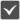

<h1 align="center">
 
  
</h1>

  
 
 
  
 
 
 
   

 A pure Rust implementation of WebRTC stack. Rewrite <a href="http://Pion.ly">Pion</a> WebRTC stack in Rust

#

    RTC
    Media
    PeerConnection
    DataChannel
     
    RTP
    RTCP
    SRTP
    SCTP
     
    DTLS
     
    ICE
    STUN
    TURN
    mDNS
     
    SDP
    Util

#

<h1 align="center">
 
</h1>

<strong>Sponsored with 💖 by</strong> 

 

